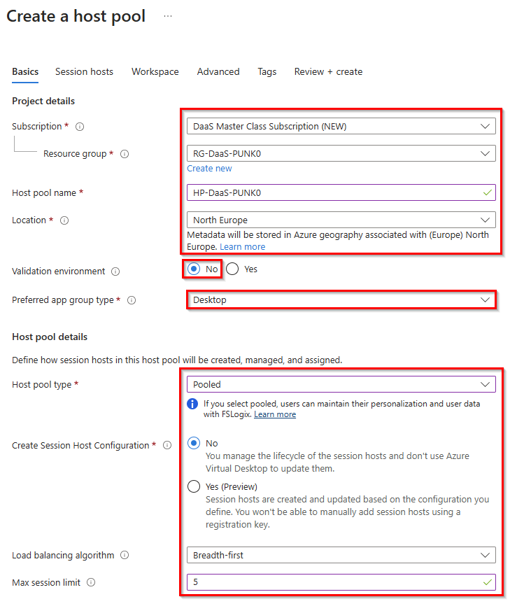
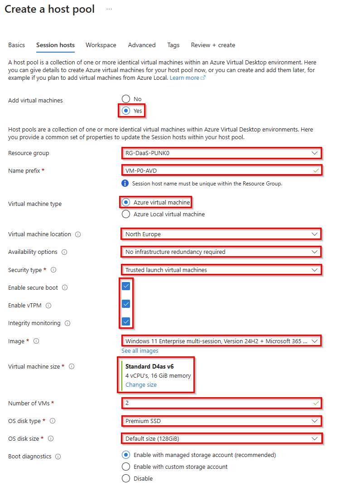
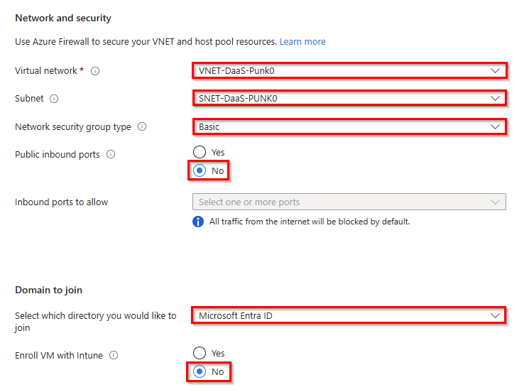
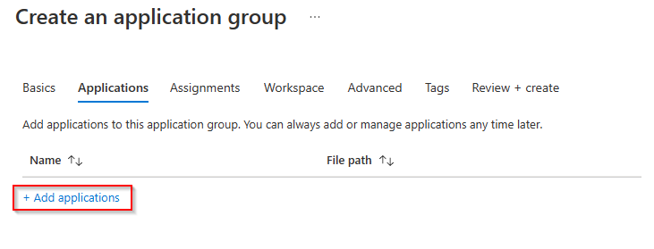

# Solutionguide 1: Create a host pool for multi-session

In this challenge you will create Azure AD joined pooled desktops from a Microsoft Windows 11 Multi-Session Gallery Image. After the deployment you will connect to this session host with the native or web Remote Desktop client. 

## Challenge

Create multi-session hostpool joined in Azure Active Directory
- West Europe Region
- Metadata located in West Europe
- Mark as Validation environment
- Host Pool type: Pooled
- Choose Windows 11 Enterprise multi-session Version + Microsoft 365 Apps Gallery image  
- Domain to join: Azure Active Directory (Enroll with Intune “Yes”)
- Register desktop app group to new workspace
- Assign users

Login to the session host
- Log in as a user and verify that the operating system is a multi-session build

Deploy Microsoft Edge and Word (or whatever) as Remote App

## Success Criteria
1.	Host Pools are created and Session Hosts are showing available
2.	Users are assigned to the appropriate application group of the host pool
3.	Able to show the Host Pool settings configured
4.	VMs are joined to Azure AD
5.  Users can sign in to the VM
6.  Office Apps can be accessed via RemoteApp

## Step 1 - Create a new Pooled Host Pool and Workspace

1.  Sign in to the [Azure Portal](https://portal.azure.com/).

2.  Search for **Azure Virtual Desktop** and select it from the list.

3.  Under Manage, select **Host pools** and select **+ Create**.
   

4.  On the Basics page, refer to the following screenshot to fill in the required fields. Select your Subscription, Resource Group and define a Hostpool name. As Location choose **West Europe**. 

> **Info:** This will only effect metadata. The Datacenter location for virtual machines will follow. 

Change **Validation environment** to **No**.
Once complete, select **Next: Virtual Machines**.

5. Navigate to **Virtual Machines** at the top and select **Yes** to add new virtual machines to your AVD Host pool.

Select your **Resource group** and enter a **VM name prefix**, it will automatically append "-[number]" to the VM name. Follow the values shown in the image below:

In the last step, enter your local admin credentials, skip the custom URL configuration and click **Next: Workspace**.
 
7.  On the Workspace page, select **Yes** to register a new desktop app group. Select **Create new** and provide a **Workspace name**. Select **OK** and **Review + create**.

8.  On the Create a host pool page, select **Create**.

> **Note**: If you are trying to access your virtual desktop from Windows devices or other devices that are not connected to Azure AD, add **targetisaadjoined:i:1** as a custom RDP property to the host pool. [More information here](https://learn.microsoft.com/en-us/azure/virtual-desktop/deploy-azure-ad-joined-vm#access-azure-ad-joined-vms)

## Step 2 - Assign user access to host pool

After you've created your host pool, you must assign users access to the desktop application group. We recommend that you use user groups instead of individual users wherever possible. As you already assigned the Virtual Machine User Login or Virtual Machine Administrator Login permissions in Challenge 1 on the resource group level, this task is not necessary here anymore. If you didn´t do it yet, or if you use another resource group, go ahead and assign these roles to the users who should be able to login to the pooled desktops.

1. Assign your users or groups to the **HP-PooledVMs-DAG** desktop application group.

2. Assign your users the **Virtual Machine User Login** role so they can sign in to the VMs.

3. **optional** Assign administrators who need local administrative privileges the Virtual Machine Administrator Login role.
To grant users access to Azure AD-joined VMs, you must [configure role assignments for the VM](https://docs.microsoft.com/en-us/azure/active-directory/devices/howto-vm-sign-in-azure-ad-windows#configure-role-assignments-for-the-vm). 

## Step 3 - Create Remote Apps

To make only a single application available to the user, instead of the full desktop, so that only the application is rendered on your host device from which you are currently working from, you need to create a remote application group. Follow the guidance:

1. Navigate to the Azure Virtual Desktop and select **Application Groups** and click **Create**.

2. On the Basic tab, select your **resource group**, your multi-session AVD **host pool** and enter an **application group name**.

Click **Next: Applications**

2. Next, select the application you want to add to its application group and click **Add applications**.

Then select **Start menu** as the application source and **Microsoft Edge** (for example) as the application .

Click **Review + add**, then **Add** and add another application from the start menu as the application source.

Click **Next: Assignments**.

3. Assign the AVD Users group to the Application group which should have access to the RemoteApps.

Click **Next: Workspace**

4. Toggle **Register Application Group** to yes and click **Review + create**.

> If another application group in the AVD host pool has already been registered then this app group will also be registered to that same workspace.

Next, start your Remote Desktop Client App, refresh the AVD Workspace and launch the Remote Apps.

> **Note**: If you are trying to access your virtual desktop from Windows devices or other devices that are not connected to Azure AD, add **targetisaadjoined:i:1** as a custom RDP property to the host pool. [More information here](https://learn.microsoft.com/en-us/azure/virtual-desktop/deploy-azure-ad-joined-vm#access-azure-ad-joined-vms)

## Learning Resources
- [Create Azure Virtual Desktop Hostpool](https://learn.microsoft.com/en-us/azure/virtual-desktop/create-host-pools-azure-marketplace)
- [Manage app groups for Azure Virtual Desktop portal](https://learn.microsoft.com/en-us/azure/virtual-desktop/manage-app-groups)
- [Connect to Azure Virtual Desktop with the Remote Desktop client for Windows](https://learn.microsoft.com/en-us/azure/virtual-desktop/users/connect-windows?tabs=subscribe#install-the-windows-desktop-client)
