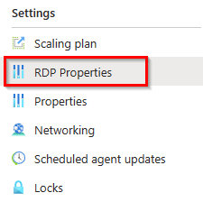

# Solutionguide 1: Configure RDP Properties

## Challenge 

- Pooled (Desktop / Remote App) Host pool 
    - Allow Multiple Displays
    - Smart Sizing should be enabled
    - Deny Camera and Microphone  
    - Deny Copy&Paste, Storage, networkdrive and printer redirection

## Success Criteria

- You can not access local or networkdrives redirected from the session host
- You can not Copy and Paste from you local devices to the desktop or remote app

## Step 1 - Configure AVD Hostpool RDP properties 

### Option 1 via Azure Portal
In your pooled / multi-session Host pool (RemoteApp), navigate to **RDP Properties**.


 
Next, configure the following RDP properties.

Display settings:
 | RDP Property | Value |
 |---|---|
 | Multiple displays | **Enable multiple display support** |
 | Smart sizing | **The local window content will scale when resized** |


Device redirection:
 | RDP Property | Value |
 |---|---|
 | Microphone redirection | **Disable audio capture from the local device**  |
 | Camera redirection | **Don't redirect any cameras** |
 | Drive/storage redirection | **Don't redirect any drives**  |
 | Clipboard redirection | **Clipboard on local computer isn't available in the remote session** |
 | Printer Redirection | **The printers on the local computer are not available in the remote session** |
 | USB device redirection | **Don't redirect any USB devices** |


Then, click **Save**.
 
### Option 2 via Powershell

To add or edit multiple custom RDP properties, run the following PowerShell cmdlets by providing the custom RDP properties as a semicolon-separated string:

```
$properties="drivestoredirect:s:;audiomode:i:0;videoplaybackmode:i:1;redirectclipboard:i:0;redirectprinters:i:0;devicestoredirect:s:*;redirectcomports:i:1;redirectsmartcards:i:1;usbdevicestoredirect:s:;enablecredsspsupport:i:1;redirectwebauthn:i:1;use multimon:i:1;audiocapturemode:i:0;camerastoredirect:s:;smart sizing:i:1"

Update-AzWvdHostPool -ResourceGroupName <resourcegroupname> -Name <hostpoolname> -CustomRdpProperty $properties
```

You can check to make sure the RDP property was added by running the following cmdlet:
```
Get-AzWvdHostPool -ResourceGroupName <resourcegroupname> -Name <hostpoolname> | format-list Name, CustomRdpProperty
```

## Learning Resources
- [Customize RDP Properties](https://learn.microsoft.com/en-us/azure/virtual-desktop/customize-rdp-properties)
- [Supported RDP Properties](https://learn.microsoft.com/en-us/windows-server/remote/remote-desktop-services/clients/rdp-files)