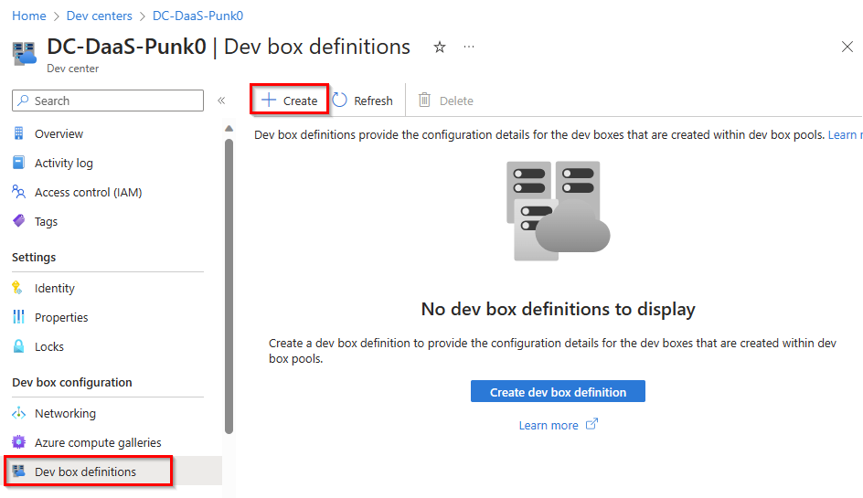
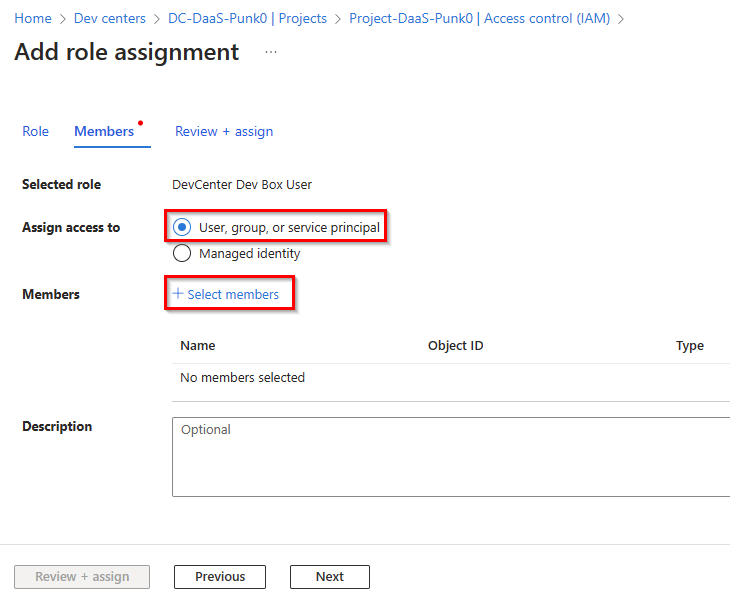

# Solutionguide 1: Configure Microsoft Dev Box

## Challenge

You have some developers in your company, and they need developer machines, sometimes just for some hours to review and commit code.

To set up your Azure Dev Center to provide Dev Boxes to your developers, you need to do the following:

- Create a dev center 
- Create **two dev box definition** with the following specs:
    - Windows 11 Enterprise
    - Visual Studio 2022 Enterprise and Microsoft 365 are pre-installed
    - 8 vCPU, 32 GB RAM and 16 vCPU, 64 GB RAN
    - 256 GB disk storage
- Create for each definition a dev box pools with Microsoft hosted network, Local Administrator rights and Auto-stop at 7:00pm
- Assign the project to your user group
- Dev box limit is set to 2

## Success Criteria
1. Two dev box size options are available in the Microsoft developer portal. 
2. Your User has local admin rights.
3. A dev box deployment is running.

## Step 1 - Create a dev center

1.  Sign in to the [Azure Portal](https://portal.azure.com/).

2.  Search for **dev centers** and select it from the list.

3.  Click **+ Create** to create new dev center. 

4.  On the Basics page, refer to the following screenshot to fill in the required fields. Select your Subscription, Resource Group and define a dev center name. As Location choose **West Europe**. 

Select **Review + Create**.

5.  When the review is passed, click **Create**.

## Step 2 - Create a project

1. **Open the dev center** created in the previous step, e.g. "DC-DaaS-Punk0".

2. Navigate to **Projects** and then select **Create**.

3. On the Basics page, refer to the following screenshot to fill in the required fields. Select your Subscription, Resource Group, Dev center and **define a project name**.

Click **"Next : Dev box management >"**.

4. On the Dev Box Management tab, **activate the dev box limit** and enter **2** dev boxes per developer as a limit. 

Select **Review + Create**.

5. When the review is passed, click **Create**.

## Step 3 - Create a dev box definition

1. **Open the dev center** created in the previous step, e.g. "Project-DaaS-Punk0".

2. Navigate to **Dev box definitions** and then select **Create**.

3. Refer to the following screenshot to fill in the required fields. Select a name, image, image version, compute size and storage size. You will create two dev box definitions.

First dev box definition with **8vCPUs and 32 GB RAM**:

Second dev box definition with **16vCPUs and 64 GB RAM**:

Select **Create**.

## Step 4 - Create a dev box pool

1. **Open your project** created in the previous step, e.g. "DC-DaaS-Punk".

2. **Select Dev box pools** under Manage and click **Create**. 

3. You must create a dev box pool for each dev box definition. Refer to the following screenshot to fill in the required fields. Select a name, dev box definition, network connection, dev box creator privileges, Auto-stop and licensing. 

Select **Deploy to a Microsoft hosted network** as Network connection, **Local administrator** as Creator authorization for the dev box, **Yes** as Auto stop option and **enter the stop time**.

Finally, confirm the licensing question.

Select **Create**.

Two dev box pools should be created.

## Step 5 - Provide access to a dev box project

1. **Open your project** created in the previous step, e.g. "DC-DaaS-Punk".

2. **Access Control (IAM)** and click on **Add** and then on **Add role assignment**.

3. Enter **DevCenter** and select the role **DevCenter Dev Box User** then click **Next**.

4. **Activate "User, group or service principal"** as an assign access option and then select **Select members**.

5. **Search for your group** and click **Select**.

6. Click **Review + assign** twice.

## Step 6 - Create a dev box and connect

1. Sign in to the [developer portal](https://aka.ms/devbox-portal) with your user credentials. 

2. Select **New dev box**.

3. Give your dev box a **name**, e.g. "My-First-Dev-Box", and **select the dev box pool**, then click **Create**.

>**Note:** The Dev Box creation takes 25 minutes on average, but can take up to 65 minutes. 

4. Once the dev box has been successfully created, you can connect.

You can also use the [Windows App](https://aka.ms/windowsapp) to establish a connection to your Dev Box.

## Learning Resources
- [What is Microsoft Dev Box?](https://learn.microsoft.com/en-us/azure/dev-box/overview-what-is-microsoft-dev-box)
- [Quickstart: Configure Microsoft Dev Box](https://learn.microsoft.com/en-us/azure/dev-box/quickstart-configure-dev-box-service)
- [Use a remote desktop client to connect to a dev box](https://learn.microsoft.com/en-us/azure/dev-box/tutorial-connect-to-dev-box-with-remote-desktop-app?tabs=windows)