# Solutionguide 1: Provision a Cloud PC

## Challenge

You have purchased one Windows 365 licenses. At this point, you can start with the provisioning of Cloud PCs.

To set up your system to provision on-demand Cloud PCs for you, you need to:

- An Entra ID group with **GRP-P[count]-Users**, e.g. GRP-P1-Users, is already created.
- Assign licenses to your user or group.
- Your User should have local admin rights for his Cloud PC.
- Your Cloud PC is using the Microsoft Hosted Networks.
- Create a provisioning policy.
- **Make sure your Cloud PC has a custom name that is not the default, for example: CPCP1-%RAND:5%"**

## Success Criteria
1.  A Windows365 & Intune License is automatically assigned to your users.
2.  Your User has local admin rights.
3.  A provisioning policy with **PP-P[count]-YourPolicyName** is created.
4.  A Cloud PC deployment is running.

## Step 1 - License assignment

Sign in to the [M365 Admin Center](https://admin.microsoft.com) with an account that has enough permissions to manage licenses, e.g. with the License Admin role. 

You can find more information about M365 administrator roles [here.](https://learn.microsoft.com/en-us/microsoft-365/admin/add-users/about-admin-roles?view=o365-worldwide)

There are two options for assigning licenses to users. 

###  [Option 1] - Per User Assignment

The first option is to assign per user. To do this, you need to select **Users** and then **Active users** to get the list of all active users. Then search for your user, e.g. **Punk1**, and select **User, Punk1**. 

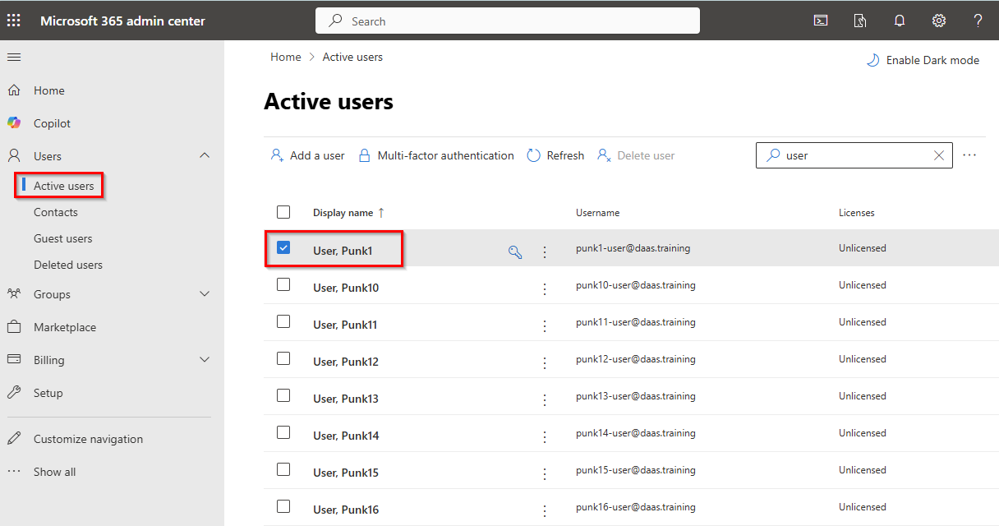

You can assign the required licenses in the user overview under **Licenses and apps**. 

Select **Microsoft 365 E5 EEA (without Teams)** to license the Microsoft 365 Office applications and Microsoft Intune. Additionally select the **Windows 365 Enterprise 2 vCPU, 8 GB, 128 GB** license. 

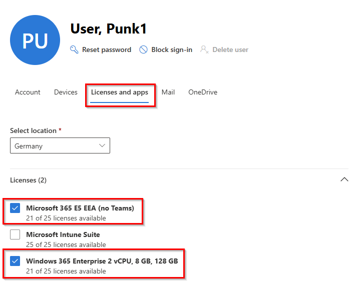

And click **Save changes**.

### [Option 2] - Per Group Assignment

Another option is to assign licenses per group. To do this, you must select **Billing** and then **Licenses**. Under **Subscriptions** you should find all available licenses. Then click on **Windows 365 Enterprise 2 vCPU, 8 GB, 128 GB**. 

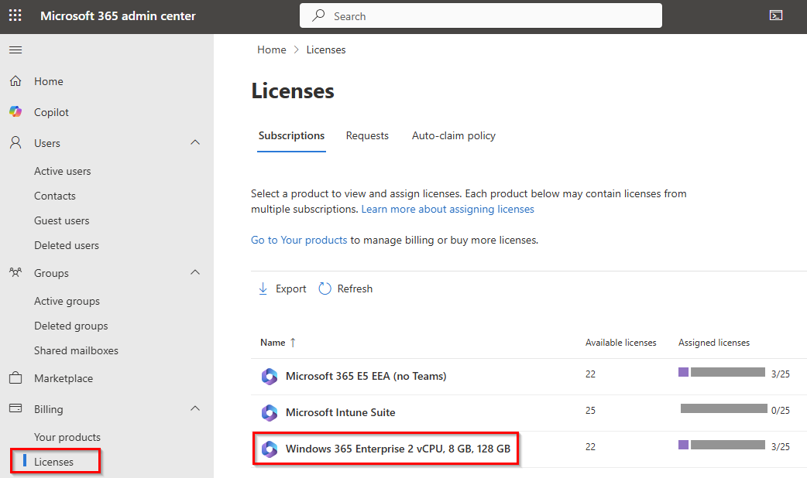

Select **Group** and then **+ Assign licenses**. 

> **Note:** Here it is also possible to select users in order to assign a license to a specific user account.    

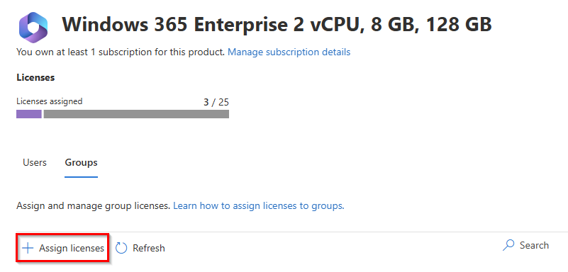

Next, search for your user group, e.g. **GRP-P1-Users**, and click **Assign**.

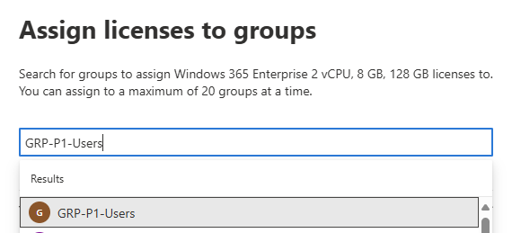

Repeat the previous step to assign the Microsoft 365 E5 licenses to your user group as well. 

## Step 2 - Configure user settings

With user settings you can determine if a user needs to get local admin rights or not. You can also configure if you want to offer the user a point-in-time restore service where snapshots of the Cloud PC are created in the frequency you configure. User settings policies are published to Microsoft Entra ID groups and you can create different User settings policies for different groups of users.

Sign in to the [Microsoft Intune](https://intune.microsoft.com/) and navigate to **Devices** then **Windows 365** to access the Windows 365 management panel. 

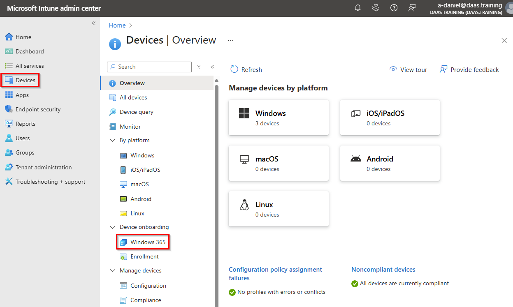

Next click **User settings**. 

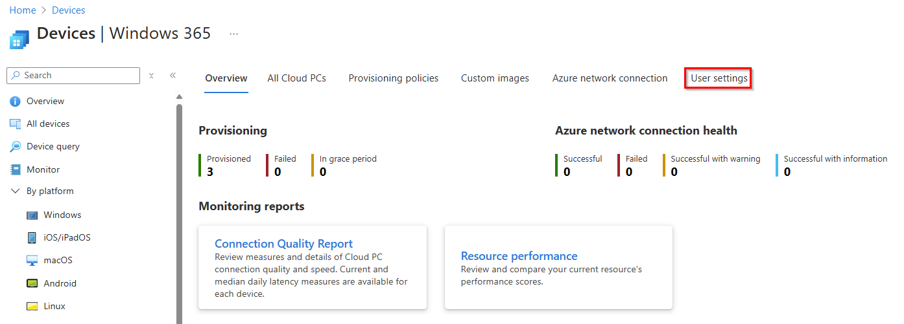

Select **+ Create** to create a new user settings configuration.

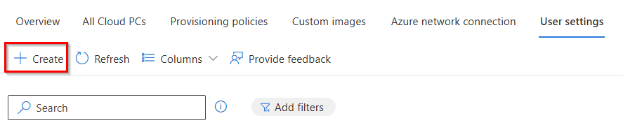

On the **Settings** tab, make the following settings:

| Setting         | Value    | 
|--------------|-----------|
| Name | Select a name for your user setting, e.g. **UserSettings-P1**      |
| Enable Local admin     | **Enabled** |
| Enable users to reset their Cloud PCs  | **Enabled** |
| Allow user to initiate restore service    | **Enabled** |
| Frequency of restore-point service    | **12 hours** |

Then click **Next**.

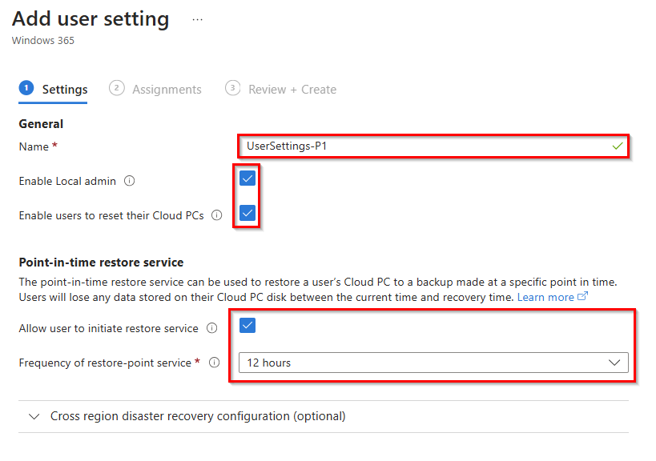

On the **Assignments** tab, select the **Add groups** option and search for your user group, e.g. **GRP-P1 users** and click **Select**.

Then click **Next** and **Create**. 

## Step 3 - Create a Provisioning Policy

To provision a Cloud PC a Provisioning Policy needs to be created. You can create multiple Provisioning policies and assign them to different **Entra ID groups**.

In the **Windows 365 management panal** select **Provisioning Policy** and select **+ Create policy**.

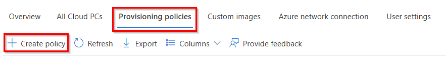

On the **Settings** tab, make the following settings:

| Setting         | Value    | Note |
|--------------|-----------|-----------|
| Name | Select a name for your provisioning policy, e.g. **PP-P1-CPC-ENGLISCH**      |
| License type    | **Enterprise** |
| Join type | **Microsoft Entra Join** |
| Network    | **Microsoft hosted network** |
| Geography  | **Germany** | You can also select **European Union**. |
| Use Microsoft Entra single sign-on | **Enabled** |

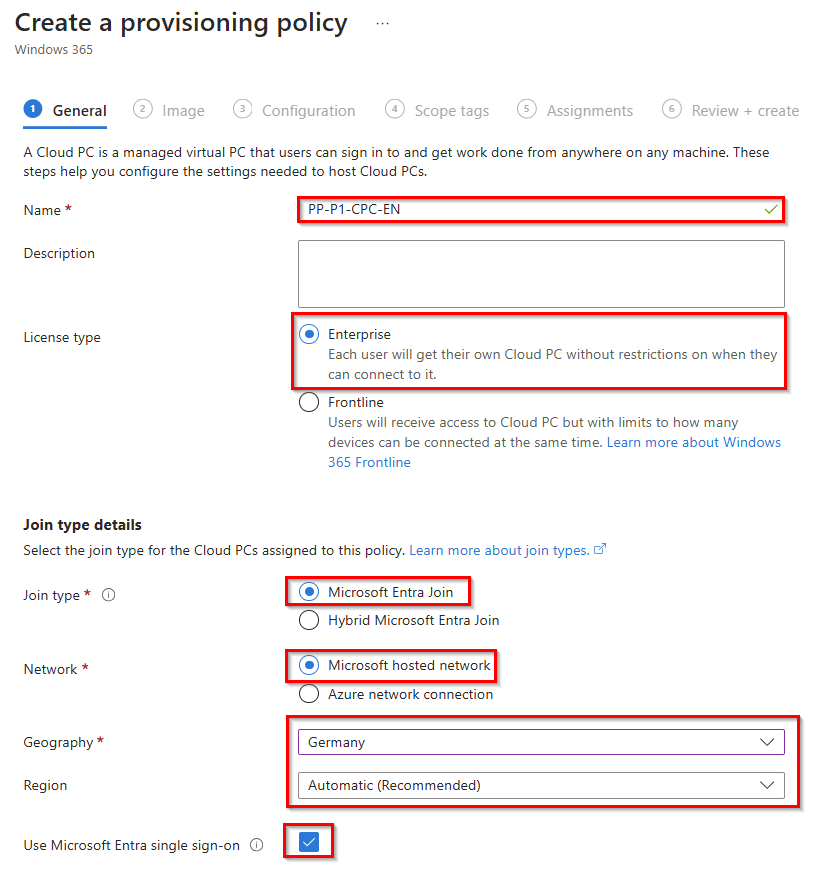

And then click **Next**.

Select an image from the **Gallery image**. When you choose Gallery image you have the choice for Windows 10 or 11, with or without the Microsoft 365 apps and the version/build.

Select the **latest Windows 11 Enterprise + Microsoft 365** image and click **Next**

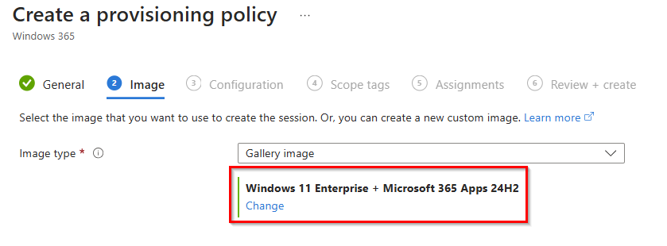

On the **Configuration** tab, under **Language & Region**, you can change the default language of your Cloud PCs during the provisioning process. This can be manually (via Windows update policies in Microsoft Intune) or via the Autopatch service.

>**Note**: If you select a language pack other than English, the provisioning of Cloud PCs will take longer. 

Under **Cloud PC naming** please activate the option **Apply device name template** so that you can use an individual Cloud PC device name for your users. Enter a **name template**, e.g. **CPC-P1-%RAND:5%**.

For additional services select **None** and click **Next**.

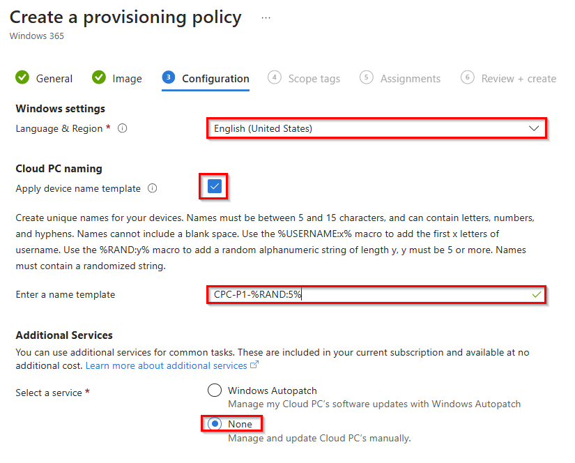

You can skip the **Scope tags** tab and continue with the **Assignments** user group. Click **Add groups** and search for your user group, e.g. **GRP-P1-Users** and click **select**. 

In the last step, click on **Next** and **Create**. 

You should then see under **All Cloud PCs** that the provisioning of the Cloud PC has been started for your user group. 

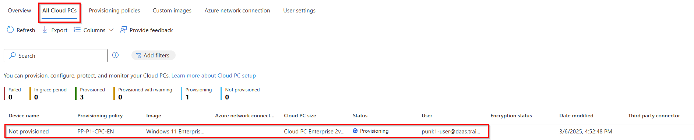

> **Note**: Provisioning a Cloud PC takes around 25-35 minutes and depends on the current queue, region and language configuration.

## Step 4 - Connect to your Cloud PC

Let's connect to the Windows 365 Cloud PC.

Open the [**Windows App Web client**](https://windows365.microsoft.com/ent) or use the **Windows App** and open the **Microsoft Store** and search for **Windows App**. If the Microsoft Store is blocked then you can use the [Windows App offline installer](https://go.microsoft.com/fwlink/?linkid=2262633) 

Log in with your user and you should see your Cloud PC under **Devices** and click **Connect** to connect to your Cloud PC.  

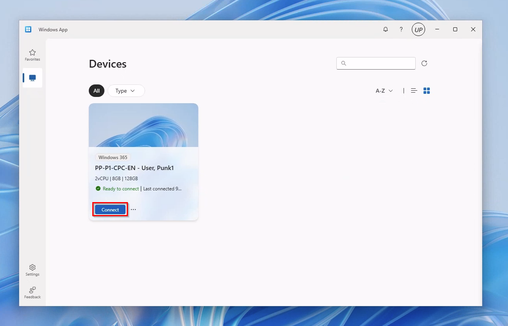

## Learning Resources
- [Deployment overview](https://learn.microsoft.com/en-us/windows-365/enterprise/deployment-overview)
- [User settings](https://learn.microsoft.com/en-us/windows-365/enterprise/assign-users-as-local-admin)
- [Create a provisioning policy](https://learn.microsoft.com/en-us/windows-365/enterprise/create-provisioning-policy)
