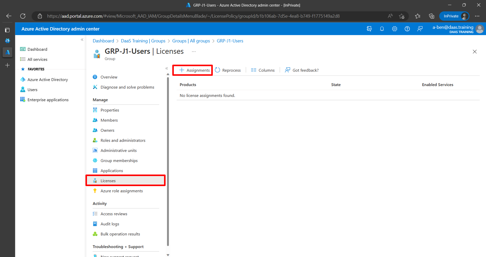

# Solutionguide 1: Provision a Cloud PC

## Challenge

You have purchased one Windows 365 licenses. At this point, you can start with the provisioning of Cloud PCs.

To set up your system to provision on-demand Cloud PCs for you, you need to:

- An Entra ID group with **GRP-P[count]-Users**, e.g. GRP-P1-Users, is already created.
- Assign licenses to your user or group.
- Your User should have local admin rights for his Cloud PC.
- Your Cloud PC is using the Microsoft Hosted Networks.
- Create a provisioning policy.
- **Make sure your Cloud PC has a custom name that is not the default, for example: CPCP1-%RAND:5%"**

## Success Criteria
1.  A Windows365 & Intune License is automatically assigned to your users.
2.  Your User has local admin rights.
3.  A provisioning policy with **PP-P[count]-YourPolicyName** is created.
4.  A Cloud PC deployment is running.

## Step 1 - License assignment
## Option 1 (for full transparency)

You can assign licenses directly to users from the [M365 Admin Center](https://admin.microsoft.com).

Select **Active users** > **Select a user**

Select **License and apps** and 

and assign the **Windows 365 Enterprise license**.

## Option 2 

Sign in to the [Azure portal](https://portal.azure.com) with a license administrator account and browse to the Azure Active Directory. As an option you can directly sign in at [Azure AD Portal](https://aad.portal.azure.com)

💡To manage licenses, the account must be a **License Administrator**, **User Administrator**, or **Global Administrator**.

Select **create group** to create a new group or **select the group** you want the licenses to be assigned to. 

Browse to Licenses to open a page where you can see and manage all licensable products in the organization.

Under All products, select both Intune and the Windows 365 Cloud PC SKU license. Select Assign and save.

## Step 2 - Configure user settings

With user settings you can determine if a user needs to get local admin rights or not. You can also configure if you want to offer the user a point-in-time restore service where snapshots of the Cloud PC are created in the frequency you configure. User settings policies are published to Azure AD groups and you can create different User settings policies for different groups of users.

In the Microsoft Intune admin center, navigate to **Devices** > **Windows 365** and click **User settings**

Click + **Add**

Give the policy a name and configure whether you want that users get local admin rights or not. 
Click **Next**

Select your **Azure AD user group** and click Next

Click **Create**

## Step 3 - Create an Azure network connection (max. 10 ANC per Tenant)

Azure network connections enables you to directly connect to your back-end systems, corporate resources and offices, without the need of a client based VPN solution.

To create an Azure network connection, navigate to **Devices** > **Windows 365** and click **Azure Network Connections** and select **Add**.

You can choose one of the following options.
**Azure AD Join**: Performs a Azure AD join.
**Hybrid Azure AD Join** (not possible in this hack): This option enables you to perform an Active Directory Domain Join. 

Note: Intune and Azure AD Connect configuration is required for Hybrid Azure AD Join.

Give the Azure Network connection a name. Select your subscription, the resource group and virtual network including the subnet.
Click **Next**

and finish with **Review + create**

This will start the creation of the Azure network connection within the Microsoft Intune admin center.

After a few minutes the Azure network connection is created and a **“checks successful”** status will be displayed.

## Step 4 - Create a Provisioning Policy

To provision a Cloud PC a Provisioning Policy needs to be created. You can create multiple Provisioning policies and assign them to different **Azure AD security groups**.

Navigate to **Devices** > **Windows 365** and click **Provisioning Policy** and select **Create policy**.

Give the policy a **name** and select the **Join type**. Azure AD Join or Hybrid Azure AD Join. For Network, select the Microsoft hosted network, or an existing Azure network connection.

Select Use single sign-on and click **Next**

Select an image from the **Gallery image**. When you choose Gallery image you have the choice for Windows 10 or 11, with or without the Microsoft 365 apps and the version/build.
Select the image of choice and click **Next**

Select the **Language & Region** of your choice and the way you want to update the Cloud PC. This can be manually (via Windows update policies in Microsoft Intune) or via the Autopatch service.
Click **Next**

Select an **Azure AD security group** and click Next.

Click **Create**

After the provisioning policy is created, Cloud PCs of assigned users will be automatically provisioned. 

After the provisioning is finished, the status will be changed to “Provisioned” and the Cloud PC is ready to use.

## Step 5 - Connect to your Cloud PC

Let's connect to the Windows 365 Cloud.

Use the **web client**. Navigate to  https://windows365.microsoft.com/

Use the **Windows 365 Store Client**. Open the Microsoft Store and install the Windows 365 Client. 

## Learning Resources
- [Deployment overview](https://learn.microsoft.com/en-us/windows-365/enterprise/deployment-overview)
- [Group Assignments](https://learn.microsoft.com/en-us/azure/active-directory/enterprise-users/licensing-groups-assign)
- [Create a provisioning policy](https://learn.microsoft.com/en-us/windows-365/enterprise/create-provisioning-policy)
