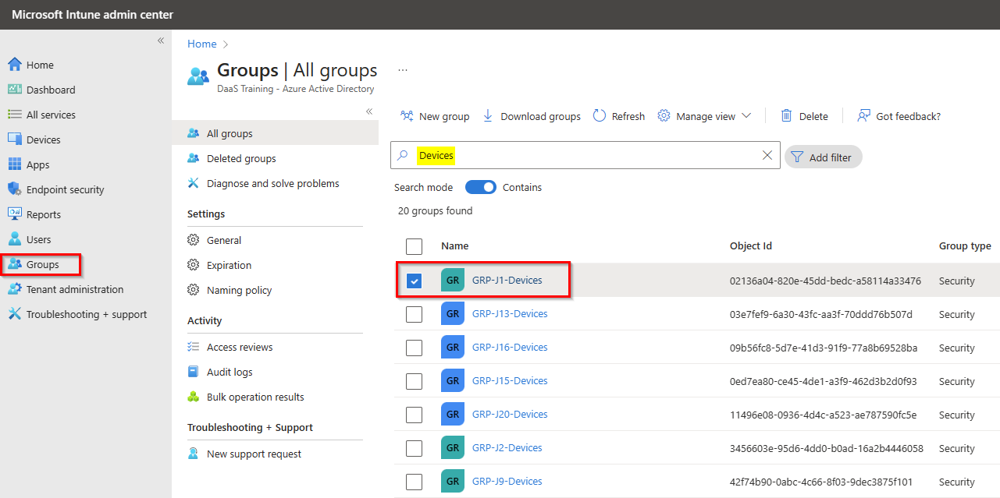
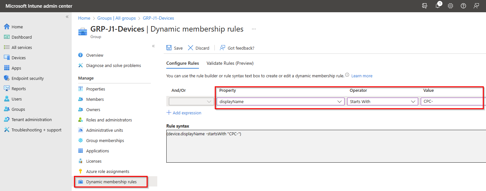
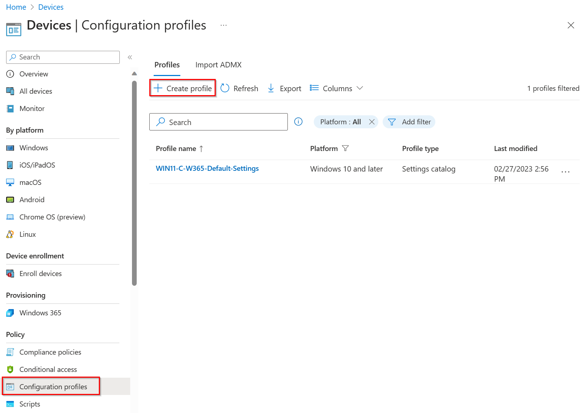
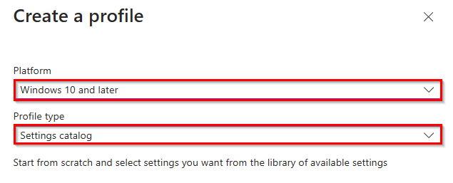
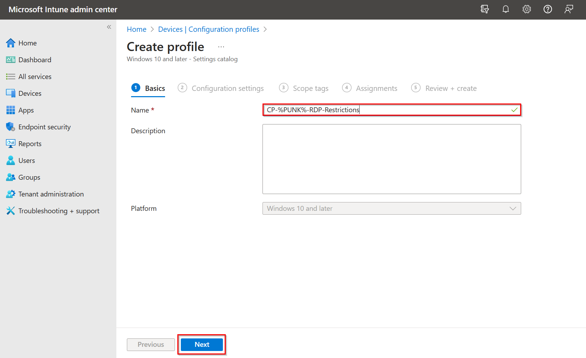
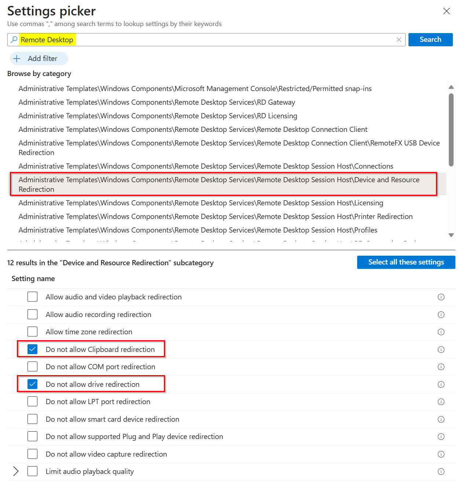
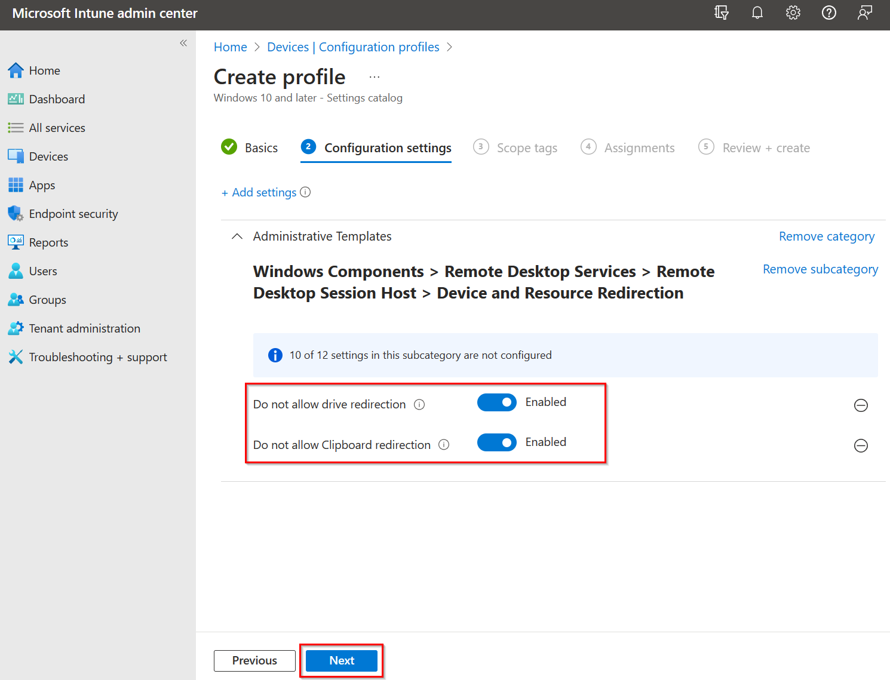
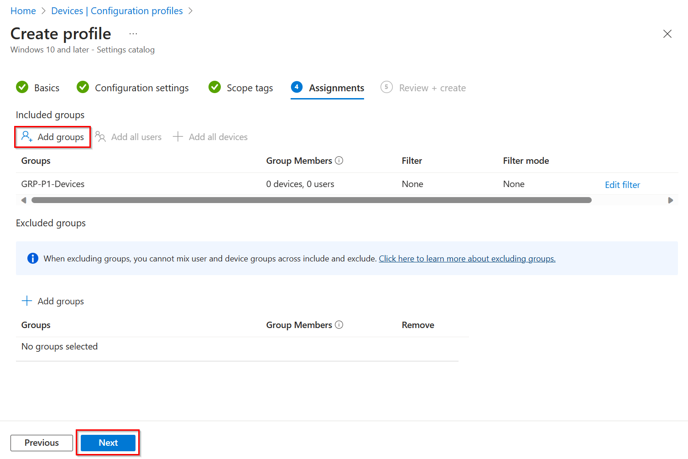

# Solutionguide 2: Configure RDP Properties

## Introduction

For **security** reasons, you want to override the default and block some devices from being redirected.

## Challenge

Your Security Team want to **prevent** that a user can **Copy & Paste** data from their local client to the Cloud PC.
In addition no local drive should be available in the remote session.

## Success Criteria

1. A new dynamic group with **your** Cloud PC is configured.
2. A new device configuration policy is created for your Cloud PC and **Copy & Paste** is not possible and **local drives** are **not** redirected.

## Step 1 - Configure your dynamic group for your Cloud PCs (Devices)

Open the Microsoft Intune Admin Center [https://in.cmd.ms/](https://in.cmd.ms/) and select **Groups** to view all Microsoft Entra ID groups. 

Then search for **Devices** (search mode should be enabled) and select your user device group.

Next, select **Dynamic Membership Rules** and add a new rule or modify the existing rule to include all devices with the display name that you have configured in the W365 provisioning profile. And then **Save**. 

Lastly, you need to check that the processing status of the dynamic rule is not "Paused", otherwise you need to change the processing pause value from **Yes to No**.

## Step 2 - Configure an Intune Device Configuration Profile for the RDP Settings

First open the **Devices** tab and select **Configuration profiles** then **Create profile** to create a new Intune Device Configuration Profile.

Select **Windows 10 and later** as Platform and **Settings catalog** as Profile type and click **Create**.

Enter your configuration profile name **CP-%PUNK%-TEXT**, e.g. CP-P1-RDP-Restrictions and click **Next**.

Click **+ Add settings** to add settings to your configuration profile. 

Next, search for **Remote Desktop** and open the catagory with **...\Device and Resource Redirection** then select **Do no allow Clipboard redirection** and **Do not allow drive redirection**.

After that you can close the settings picker.

On the Configuration Settings tab, you must enable both RDP settings and click **Next**.

The Scope Tags tab can be skipped, but the Assignment tab is important. Here you need to **Add Groups** add your specific Cloud PC device group, e.g. GRP-P1 devices.

Click **Next** and then **Create**.

## Learning Resources
- [Manage RDP Devices](https://learn.microsoft.com/en-us/windows-365/enterprise/manage-rdp-device-redirections)
- [Dynamic membership rules for groups in Azure Active Directory](https://learn.microsoft.com/en-us/azure/active-directory/enterprise-users/groups-dynamic-membership)
- [Create a device profile in Microsoft Intune](https://learn.microsoft.com/en-us/mem/intune/configuration/device-profile-create)