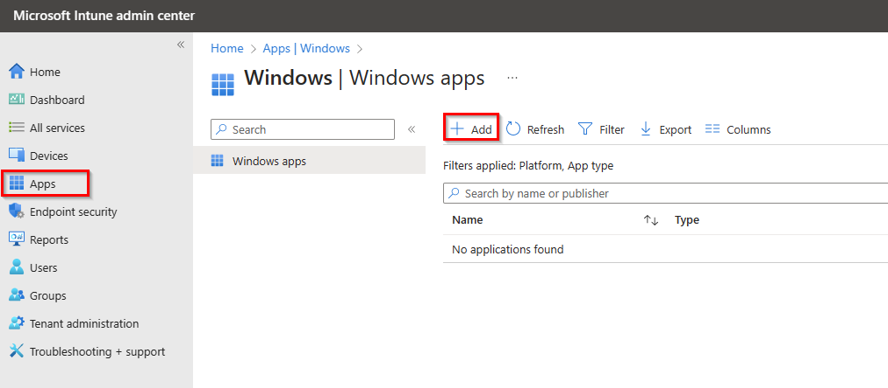
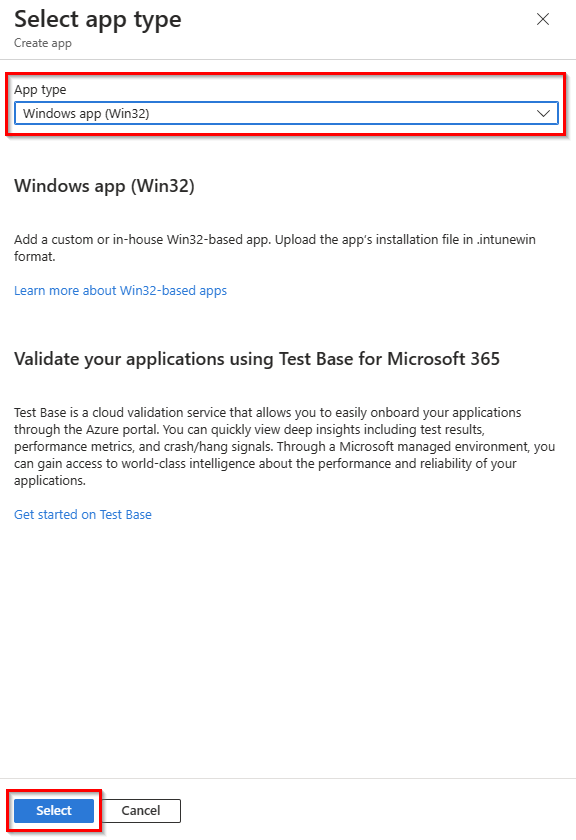
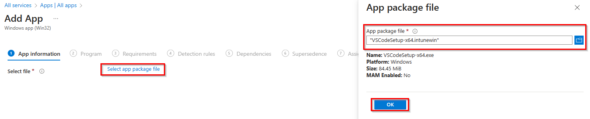
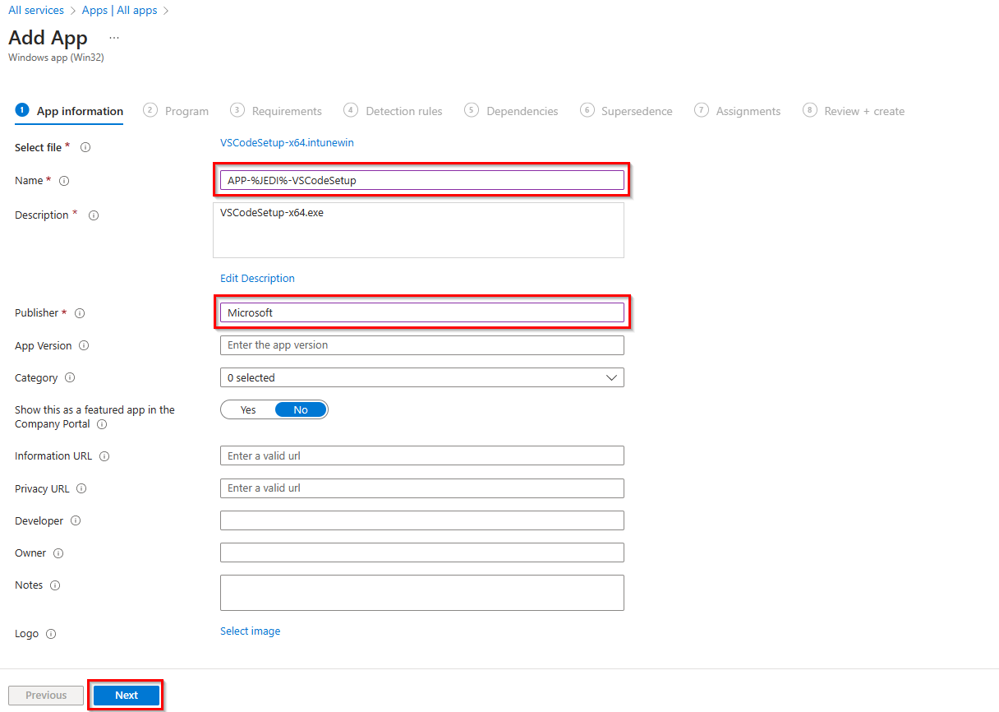
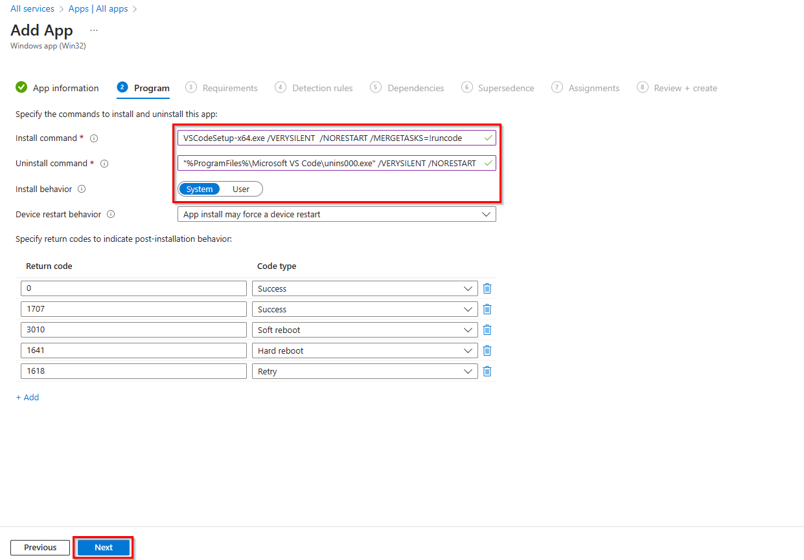
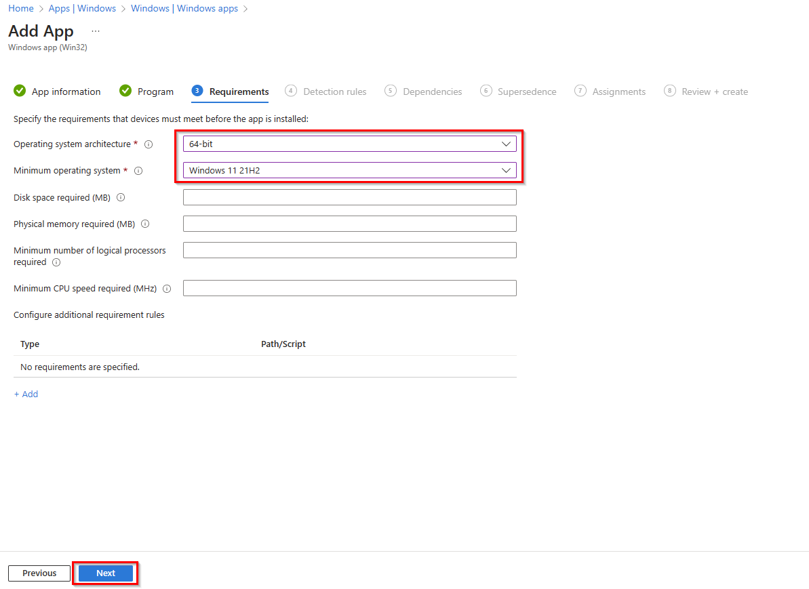
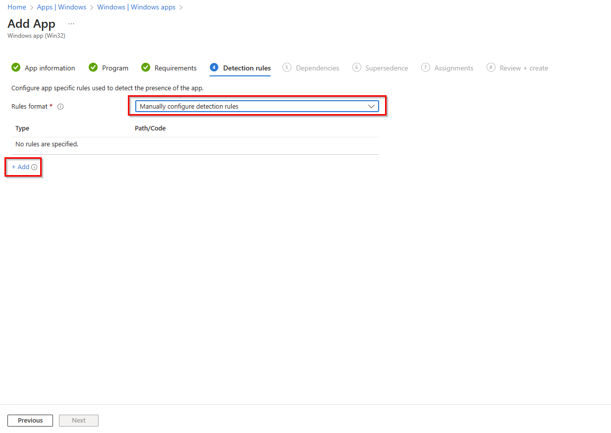
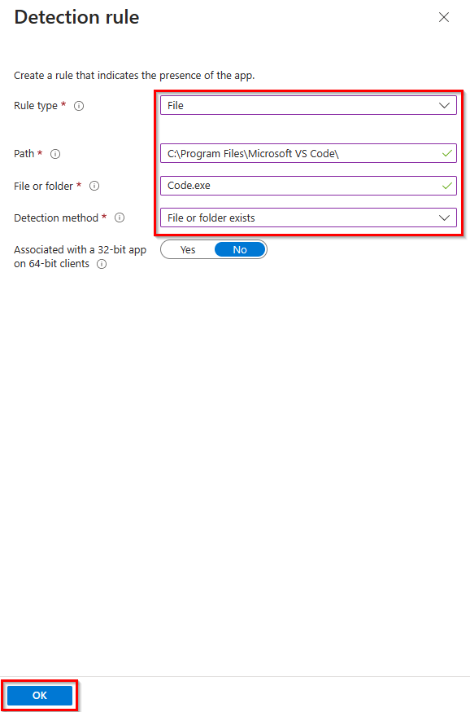
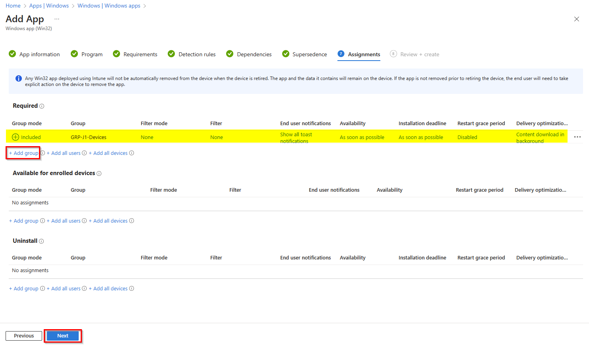

# Solutionguide 3: Deploy application via Intune

## Introduction

As an IT-admin, one of the easiest ways to get started with Windows 365 is to create Cloud PCs with default gallery images of Windows 10/11 Enterprise. 

After provisioning, you can customize the user experience by using Intune to push apps to your users’ Cloud PCs. These images can include existing Windows client apps already in your Intune environment. Since these Cloud PC devices are enrolled in Intune, you can treat them like any other Windows device in your environment.

## Challenge

It is important that your users have Visual Studio Code installed.

## Success Criteria

1.	Visual Studio Code, with the name **APP-%PUNK%-YourAppName** is available as a new Windows application (Win32) in Intune.
2.  Application Visual Studio Code is assigned and installed on your Cloud PC.


## Step 1 - Create a new Winodws app (Win32) via Intune Deployment

1.  Open the Microsoft Intune Admin Center [https://in.cmd.ms/](https://in.cmd.ms/) and select **Apps** then **Windows** to add a new Windows app. 

2. Click **Add** to add a new Windows app and select the app type **Windows app (Win32)**, then confirm with **Select**.



> **Note**: For Windows apps (Win32), you need to convert the installation sources, such as exe or msi, into an intunewim package. [Here you will find the prep tool](https://github.com/Microsoft/Microsoft-Win32-Content-Prep-Tool)



3. Next, choose **your application package in format intunewim** and click **OK**. 

> **Note**: If you do not want to create your own VSCode Intunewim package, we have prepared a package [here.](../Solutionguide/Sources/VSCodeSetup-x64.intunewin)



4. Enter your **App name**, e.g. APP-P1-VSCodeSetup, and the publisher and click **Next**.



5. On the Program tab, you need to set the installation and uninstallation commands for the application. 



For VSCode you can use the following commands:

```
# Install command: 
VSCodeSetup-x64.exe /VERYSILENT  /NORESTART /MERGETASKS=!runcode
# Uninstall command: 
"%ProgramFiles%\Microsoft VS Code\unins000.exe" /VERYSILENT /NORESTART
```
Select **System** as the installation behavior and click **Next**.

6. On the Requirements tab, you need to specify the requirements that devices must meet before the app can be installed.



Select **64-bit** as the operating system architecture and, for example, **Windows 11 21H2** as the minimum operating system. Then click **Next**.

7. Next, you need to set up a detection rule when the app is successfully installed.



Select **Manually configure detection rules** as the rules format and click **Add**. 

8. Configure the detection rule with the following values and click **OK**.

 | Setting | Value |
 |---|---|
 | Rule type | File |
 | Path | C:\Program Files\Microsoft VS Code\ |
 | File or folder | Code.exe |
 | Detection method | File or folder exists|



9. Then you can skip the Dependencies and Substitutions tab and continue with the Assignments tab.

Under Requried, click **+ Add group** and select your device group, e.g. GRP-P1-Devices, and then click **Next** to check all settings.



10. Lastly, click **Create** to add a new Windows application (Win32) to Intune.

> **Note**: The app will install as soon as possible or with the next sync, but you can press it a bit to trigger a manual sync or restart your Windows 365 Cloud PC.


## Learning Resources
- [Windows 365 and Apps](https://learn.microsoft.com/en-us/windows-365/enterprise/app-overview)
- [How to create an Intune App](https://learn.microsoft.com/en-us/mem/intune/apps/apps-win32-prepare)
- [How to assign apps to groups](https://learn.microsoft.com/en-us/mem/intune/apps/apps-deploy)
