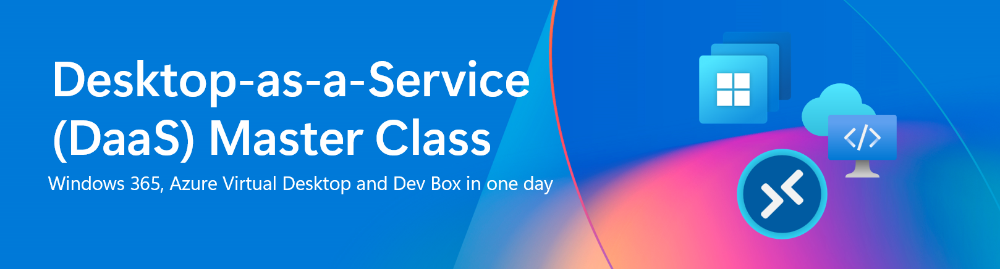
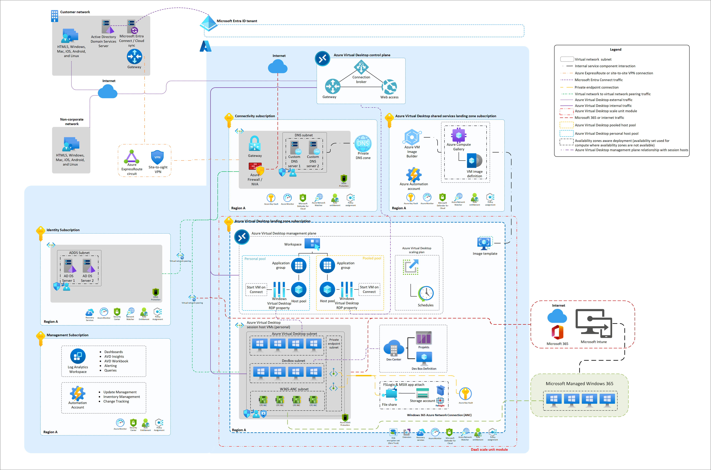

# DaaS Master Class

This master class is designed to help you get hands-on experience with Windows 365 (W365), Azure Virtual Desktop (AVD) and Microsoft Dev Box (DevBox). 
 
W365 - is a cloud-based service that automatically creates a new type of Windows virtual machine (Cloud PCs) for your end users. Each Cloud PC is assigned to an individual user and is their dedicated Windows device. Windows 365 provides the productivity, security, and collaboration benefits of Microsoft 365.

AVD – is a born-in-the-cloud desktop-as-a-service platform service offered entirely on our Microsoft Intelligent Cloud. All traditional infrastructure services such as brokering, web access, load balancer, management and monitoring are part of the AVD control plane and can be configured from the Azure portal, via the Azure Resource Manager (ARM), Biceps or Terraform. 

DevBox - is an Azure service that gives developers self-service access to preconfigured, project-specific developer boxes. You can configure dev boxes with tools, source code, and prebuilt binaries that are specific to a project, so developers can immediately start work. You can create your own customized image, or use a preconfigured image from Azure Marketplace, complete with Visual Studio already installed.
 
## Learning objectives 

Discover how to select the best DaaS option and master your Windows365, Azure Virtual Desktop and Dev Box scenario!

In this Master Class you will learn how to set up and manage Windows365 cloud PCs and AVD solutions with Microsoft tools and set up dev boxes via the Azure Dev Center.

We’ll cover topics such as building an Windows 365, AVD setting and Dev Boxes, Intune device config policies, handling the RDP properties, and launching custom images.

You’ll finish this Master Class with the understanding and abilities necessary to rule the DaaS realm and create your own Windows 365, AVD and Dev Box scenario!

## Requirements

- Basic Azure knowledge [(Azure fundamentals)](https://learn.microsoft.com/en-us/training/paths/azure-fundamentals-describe-azure-architecture-services/)
- Basic Intune knowledge [(Microsoft Intune fundamentals)](https://learn.microsoft.com/en-us/training/paths/endpoint-manager-fundamentals/)

## Agenda

1.	Welcome [15min]
2.	Introduction - Windows 365, Azure Virtual Desktop and Dev Box [45min]
3.  Getting started with Azure Virtual Desktop [120min]
4.	Getting started with Windows 365 [120min]
5.	Getting started with Microsoft Dev Box [60min]
6.	Q&A

## Rules

 1. Do not abuse the power of Admin Rights to sabotage or manipulate other attendees and their resources.
 2. You will receive your Admin & User credentials personally, take good care of it.
 3. Please name all your resources with **PUNK[count]**, e.g. PUNK1. 

## The environment

This is the W365, AVD & DevBox Masterclass Architecture:

## Credentials

You will receive your Admin & User credential personally and take good care of it.

# Access Windows Cloud Solutions

- [Webclient](https://windows.cloud.microsoft/)
- [Windows App (store)](https://apps.microsoft.com/detail/9N1F85V9T8BN) or [Windows App (offline installer)](https://go.microsoft.com/fwlink/?linkid=2262633)

## Challenges

### Azure Virtual Desktop

- Challenge 1: **[Create a host pool for multi-session desktops](Challenges/AVD/01-AVD-Multi-Session-Hostpool.md)**
- Challenge 2: **[Configure RDP Properties](Challenges/AVD/02-AVD-RDP-Properties.md)**
- Challenge 3: **[Enable FSLogix Profile Container](Challenges/AVD/03-AVD-FSLogix.md)**

### Windows 365

- Challenge 1: **[Provisioning a Cloud PC](Challenges/W365/01-W365-Provisioning-CPC.md)**
- Challenge 2: **[Configure RDP Properties](Challenges/W365/02-W365-RDP-Properties.md)**
- Challenge 3: **[Deploy application via Intune](Challenges/W365/03-W365-App-Deployment.md)**

### Dev Box

- Challenge 1: **[Configure Microsoft Dev Box](Challenges/DevBox/01-DevBox-Configure-Dev-Box.md)**

## Contributor

- [Ben Martin Baur](https://www.linkedin.com/in/ben-martin-baur/)
- [Daniel Weppeler](https://www.linkedin.com/in/daniel-weppeler/)

Engineered and powered by [avdpunks.com](https://avdpunks.com)
